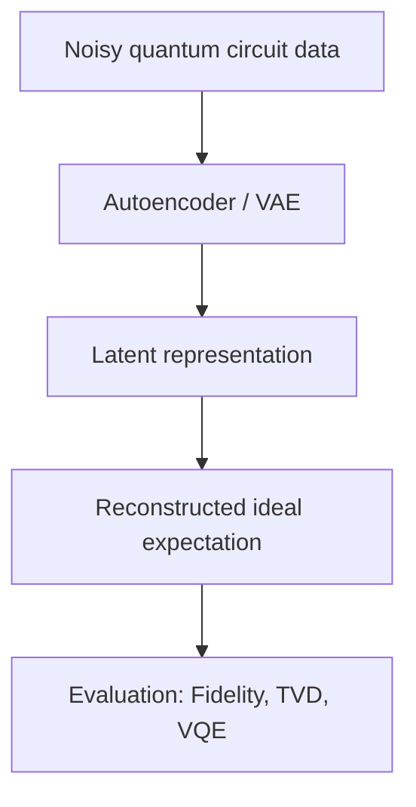

<!-- HEADER -->

  <h1>양자 컴퓨터의 연산 과정에서 발생하는 노이즈 완화를 위한 머신러닝 솔루션</h1>
  
<em>QEM Machine Learning Solution</em>

  <!-- 핵심 배지 -->
  

    
    
    
    
  

  <!-- 네비게이션 -->
  

    <a href="#프로젝트-소개">소개</a>
    <a href="#연구-주제">연구 주제</a>
    <a href="#members">Members</a>
    <a href="#roadmap">Roadmap</a>
  

---

## 📌 프로젝트 소개
팀명 <b>Qubit</b>은 양자컴퓨팅의 최소 단위이자  
여러 가능성을 동시에 품는 <b>중첩(Superposition)</b> 개념에서 영감을 얻었습니다.

우리 팀은 각자 가진 <b>다양한 역량과 잠재력</b>을 모아  
<b>실험적 탐구</b>와 <b>성장</b>을 최우선으로 하는 프로젝트를 만들어 갑니다.

---

## 🧠 연구 주제
### 🎯 주제
**양자 컴퓨터의 연산 과정에서 발생하는 노이즈 완화를 위한 머신러닝 솔루션 (Quantum Error Mitigation)**  
시뮬레이터에서 noisy–ideal 데이터를 학습하고,실제 장비 데이터로 전이 학습(fine-tuning)해 노이즈를 보정하는 모델을 만들고 검증합니다.

### 🧐 문제 정의
- **왜 중요한가?**  
  NISQ 시대의 양자컴퓨터는 decoherence, gate error, readout noise 때문에 결과가 쉽게 틀어집니다.

- **기존 기법 한계**  
  Calibration matrix → 큐비트 늘면 행렬 크기 폭발  
  ZNE → 샘플링 많이 필요  
  PEC → 정확하지만 비용 큼
- **우리가 시도할 것**  
  - Qiskit Fake Backend로 noisy–ideal 데이터 쌍 생성  
  - Autoencoder / VAE로 노이즈 복원 학습  
  - IBM Quantum 백엔드 실데이터로 transfer learning  
  - LoRA 적용으로 적은 데이터·적은 연산으로 fine-tuning

### 🎯 목표
- ZNE 대비 더 낮은 오차, 더 적은 오버헤드  
- 다른 백엔드·회로에도 잘 적용되는 범용 모델  
- 학부 수준에서 재현 가능한 실험적 프레임워크 제시

### 🚀 기대 효과
- NISQ 장비에서 신뢰도 있는 결과 → VQE, QAOA 실행 가능  
- 시뮬레이터 선학습 덕분에 데이터 수집 비용 ↓  
- LoRA 덕분에 학습·추론 시간 ↓  
- 머신러닝 기반 QEM의 실용 가능성 검증

### 🖼️ 파이프라인

### ⏳ 프로젝트 기간 <b>2025.09 ~ 2026.07</b>

### 👩‍💻 Members

<table style="font-size:50%"; > <thead> <tr> <th>이름</th> <th>역할</th> <th>소속/학번</th> <th>Tech Stack</th> <th>CV</th> </tr> </thead> <tbody> <tr> <td><b>이솔민</b></td> <td>Leader</td> <td>이화여자대학교 컴퓨터공학과 22 / 경영 복수전공</td> <td><code>HTML</code> <code>CSS</code> <code>React</code> <code>Tailwind</code> <code>C</code> <code>JavaScript</code></td> <td>  </td> </tr> <tr> <td><b>김은솜</b></td> <td>Member</td> <td>이화여자대학교 컴퓨터공학과 22</td> <td><code>Java</code> <code>Python</code> <code>C++</code></td> <td>  </td> </tr> <tr> <td><b>김정민</b></td> <td>Member</td> <td>이화여자대학교 컴퓨터공학과 22</td> <td><code>HTML</code> <code>CSS</code> <code>C++</code></td> <td>  </td> </tr> </tbody> </table>

### 🗺️ Roadmap 
- [ ] 데이터셋/노이즈 시뮬레이션 초기 버전 구축 
- [ ] Autoencoder/Variational Autoencoder 학습 
- [ ] Fidelity·Trace distance 비교 실험 
- [ ] 결과 시각화 & 보고서 작성 
- [ ] 최종 포스터/발표 준비 
--- 
 © 2025 Team Qubit — All Rights Reserved  <a href="./docs/">📁 Browse docs/</a> 

