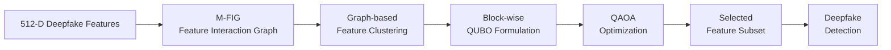

## 📌 프로젝트 소개

<h3>
  딥페이크 이미지의 고차원 feature를 
  <strong>그래프 구조</strong>로 이해하고, 
  <strong>양자 최적화</strong>로 핵심 feature를 선택하는 연구
</h3>

  
  
  

  <em>
    From high-dimensional deepfake features 
    to graph-aware quantum feature selection.
  </em>

---

<table>
<tr>
<td width="33%" valign="top">

### 01  
### Deepfake Features

딥페이크 탐지를 위해 추출된  
512차원 고차원 feature를 사용한다.

이 feature들은 얼굴의 미세한 위조 단서를 포함하지만,  
동시에 중복성과 높은 탐색 비용을 가진다.

</td>
<td width="33%" valign="top">

### 02  
### M-FIG Modeling

각 feature dimension을 node로 보고,  
feature 간 관계를 weighted edge로 표현한다.

이를 통해 feature vector를 단순한 숫자 배열이 아니라  
상호작용을 가진 graph structure로 해석한다.

</td>
<td width="33%" valign="top">

### 03  
### Block-QAOA

M-FIG 기반 clustering으로  
관련 feature들을 block 단위로 구성한다.

각 block 내부에서 QUBO 정식화와 QAOA 최적화를 수행해  
중요 feature subset을 선택한다.

</td>
</tr>
</table>

---

### Research Pipeline

```mermaid
flowchart LR

A[512-D Deepfake Features] 
    --> B[M-FIG<br/>Feature Interaction Graph]

B --> C[Graph-based<br/>Feature Clustering]

C --> D[Block-wise<br/>QUBO Formulation]

D --> E[QAOA<br/>Optimization]

E --> F[Selected<br/>Feature Subset]

F --> G[Deepfake<br/>Detection]
```

---

> 본 연구는 고차원 feature selection 문제를  
> 단순한 차원 축소가 아니라,  
> **feature 간 관계를 보존하는 양자 조합 최적화 문제**로 재정의한다.

---

## 🧭 Motivation

딥페이크 이미지는 점점 더 정교해지고 있으며,  
이를 탐지하기 위해서는 단순한 시각적 차이를 넘어  
얼굴 영역에 숨어 있는 미세한 위조 단서를 포착해야 한다.

최근 딥페이크 탐지 모델은 이러한 단서를 표현하기 위해  
512차원 이상의 고차원 feature representation을 활용하지만,  
모든 feature가 탐지 성능에 동일하게 기여하는 것은 아니다.

고차원 feature는 높은 표현력을 제공하는 동시에  
다음과 같은 문제를 가진다.

- 중복 feature로 인한 비효율성
- feature 수 증가에 따른 탐색 공간 폭증
- 모델 해석 가능성 저하
- NISQ 환경에서의 양자 최적화 적용 한계

---

## ⚛️ Our Approach

본 연구는 딥페이크 feature selection 문제를  
양자 조합 최적화 관점에서 해결하고자 한다.

이를 위해 512차원 feature를  
**M-FIG(Multi-Feature Interaction Graph)**로 모델링하고,  
feature 간 관계를 반영한 그래프 기반 클러스터링을 통해  
QAOA가 처리 가능한 block 단위로 분할한다.

각 block에서는 **QUBO 정식화**와 **Block-QAOA 최적화**를 수행하여  
탐지 성능에 기여하는 핵심 feature subset을 선택한다.

---

## ✨ Core Idea

| Problem | Insight | Solution |
|---|---|---|
| 고차원 feature는 탐색 공간이 매우 큼 | 모든 feature가 동일하게 중요하지는 않음 | QAOA 기반 feature selection |
| 단순 순차 분할은 feature 관계를 잃을 수 있음 | 관련 feature는 함께 최적화되어야 함 | M-FIG 기반 graph clustering |
| NISQ 환경에서는 큰 문제를 직접 처리하기 어려움 | 작은 block 단위 최적화가 필요함 | Block-QAOA pipeline |

---

## 🧩 One-line Summary

> **M-FIG 기반 Graph Clustering으로 feature 관계를 보존하고, Block-QAOA를 통해 딥페이크 탐지에 중요한 핵심 feature subset을 선택한다.**
