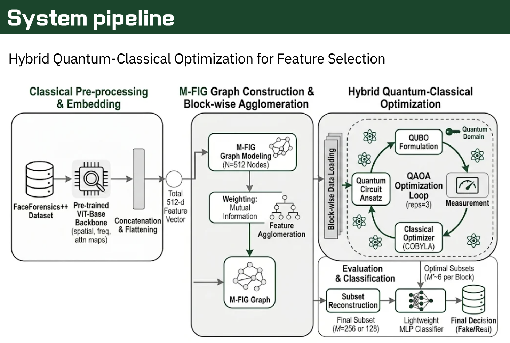

<!-- HEADER -->

  <h1>
    Graph-Clustered Block-QAOA 
    for Deepfake Feature Selection
  </h1>

  

    <em>딥페이크 이미지 Feature Selection을 위한 그래프 기반 클러스터링 블록-QAOA</em>
  

  

    
    
    
  

  

    <em>
      A graph-aware quantum feature selection pipeline 
      for high-dimensional deepfake representations
    </em>
  

  

    
    
    
    
    
    
  

---

## ▶ Project Introduction

<h3>
  From High-Dimensional Deepfake Features 
  to Graph-Aware Quantum Feature Selection
</h3>

  <em>
    딥페이크 이미지의 고차원 특징을 그래프 구조로 해석하고, 
    Block-QAOA를 통해 핵심 feature subset을 선택하는 연구

 
  </em>

  

본 프로젝트는 딥페이크 이미지 탐지에서 사용되는 고차원 feature representation의 비효율성을 줄이기 위해,
그래프 기반 feature clustering과 양자 근사 최적화 알고리즘인 QAOA를 결합한 feature selection pipeline을 제안한다.

본 연구는 딥페이크 feature를 단순한 벡터가 아니라 feature 간 관계를 가진 graph structure로 해석하고,
이를 기반으로 제한된 NISQ 환경에서도 적용 가능한 Block-QAOA 기반 feature selection 방법을 설계한다.

---

### 🧭 Motivation Flow

<table>
<tr>
<td width="8%" align="center"><b>01</b></td>
<td width="28%"><b>Increasing Deepfake Realism</b></td>
<td>
최근 생성형 AI의 발전으로 딥페이크 이미지는 점점 더 정교해지고 있으며, 
육안으로 진위 여부를 구분하기 어려워지고 있다.
</td>
</tr>

<tr>
<td align="center"><b>02</b></td>
<td><b>Need for Subtle Feature Analysis</b></td>
<td>
딥페이크 탐지는 단순한 시각적 차이가 아니라, 피부 질감의 비자연성, 얼굴 영역 간 불일치, 
주파수 왜곡, 생성 모델 특유의 artifact와 같은 미세한 위조 단서를 포착해야 한다.
</td>
</tr>

<tr>
<td align="center"><b>03</b></td>
<td><b>Limitation of Existing Detectors</b></td>
<td>
CNN 또는 ViT 기반 탐지 모델은 고차원 feature representation에 의존하는 경우가 많으며, 
이는 연산 비용, 저장 비용, feature 중복성 증가로 이어질 수 있다.
</td>
</tr>

<tr>
<td align="center"><b>04</b></td>
<td><b>Need for Efficient Feature Selection</b></td>
<td>
탐지 성능에 중요한 feature subset을 선택하면, 성능을 유지하면서도 
모델의 효율성과 해석 가능성을 높일 수 있다.
</td>
</tr>

<tr>
<td align="center"><b>05</b></td>
<td><b>Optimization Challenge</b></td>
<td>
Feature selection은 각 feature를 선택할지 말지를 결정하는 조합 최적화 문제이며, 
feature 수가 증가할수록 탐색 공간이 기하급수적으로 커진다.
</td>
</tr>

<tr>
<td align="center"><b>06</b></td>
<td><b>QAOA with NISQ Limitation</b></td>
<td>
QAOA는 조합 최적화 문제에 유망한 접근법이지만, 현재의 NISQ 환경에서는 
512차원 feature 전체를 한 번에 최적화하기 어렵다.
</td>
</tr>
</table>

---

### ▶ Proposed Approach

<h3>
  We propose an M-FIG based Graph-Clustering Block-QAOA framework 
  for structure-aware and efficient deepfake feature selection.
</h3>
 
 
 

본 연구는 딥페이크 이미지에서 추출된 512차원 feature를 단순한 숫자 배열로 보지 않고, feature 간 관계를 가진 상호작용 그래프로 해석한다.이를 위해 각 feature dimension을 node로 정의하고, feature 간 상관관계와 의존성을 edge weight로 표현하는 M-FIG(Multi-Feature Interaction Graph)를 구성한다. 이후 M-FIG를 기반으로 관련 있는 feature들을 block 단위로 clustering하고, 각 block 내부에서 **QUBO 정식화**와 **Block-QAOA 최적화**를 수행하여 딥페이크 탐지에 중요한 feature subset을 선택한다.

---

### ✨ Core Components

| Component | Role |
|---|---|
| **512-D Feature Representation** | 딥페이크 이미지의 미세한 위조 단서를 표현하는 고차원 feature |
| **M-FIG** | feature dimension 간 관계를 weighted graph로 모델링 |
| **Graph-based Clustering** | 관련 feature들을 같은 block으로 구성 |
| **QUBO Formulation** | feature selection 문제를 binary optimization 문제로 변환 |
| **Block-QAOA** | 각 block 내부에서 핵심 feature subset을 선택 |
| **Classifier** | 선택된 feature subset을 사용하여 Fake/Real 판별 수행 |

---

## 🔬 Research Pipeline

  

  <em>
    Figure 1. M-FIG based Graph-Clustering Block-QAOA pipeline for deepfake feature selection.
  </em>

The proposed framework consists of three stages:  
classical feature extraction, M-FIG based graph construction, and hybrid quantum-classical feature selection.

## 📌 Research Contribution

본 연구의 주요 기여는 다음과 같다.

1. **M-FIG 기반 feature interaction modeling**  
   딥페이크 이미지에서 추출된 512차원 feature를 단순한 벡터가 아니라,  
   feature 간 관계를 가진 weighted graph로 모델링하였다.

2. **Graph-based block construction**  
   기존의 sequential partitioning 방식과 달리,  
   feature 간 관계를 반영하여 관련 feature들이 같은 block에 배치되도록 구성하였다.

3. **NISQ-aware Block-QAOA pipeline**  
   512차원 feature 전체를 직접 QAOA에 입력하기 어려운 NISQ 제약을 고려하여,  
   block-wise quantum optimization 구조를 설계하였다.

4. **Efficient deepfake feature selection**  
   고차원 feature 중 탐지에 중요한 subset을 선택함으로써,  
   연산 효율성과 모델 해석 가능성을 높이는 방향을 제안하였다.

### 👩‍💻 Members

<table style="font-size:50%"; > <thead> <tr> <th>이름</th> <th>역할</th> <th>소속/학번</th> <th>Tech Stack</th> <th>CV</th> </tr> </thead> <tbody> <tr> <td><b>이솔민</b></td> <td>Leader</td> <td>이화여자대학교 컴퓨터공학과 22 / 경영 복수전공</td> <td><code>HTML</code> <code>CSS</code> <code>React</code> <code>Tailwind</code> <code>C</code> <code>JavaScript</code></td> <td>  </td> </tr> <tr> <td><b>김은솜</b></td> <td>Member</td> <td>이화여자대학교 컴퓨터공학과 22</td> <td><code>Java</code> <code>Python</code> <code>C++</code></td> <td>  </td> </tr> <tr> <td><b>김정민</b></td> <td>Member</td> <td>이화여자대학교 컴퓨터공학과 22</td> <td><code>HTML</code> <code>CSS</code> <code>C++</code></td> <td>  </td> </tr> </tbody> </table>

--- 
 © 2025 Team Qubit — All Rights Reserved  <a href="./docs/">📁 Browse docs/</a> 

