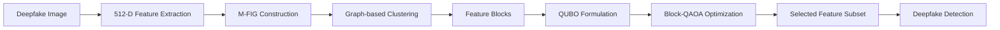
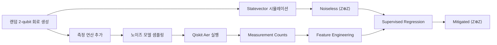
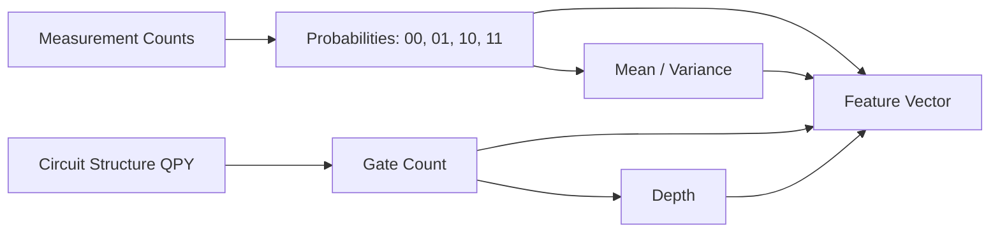

<!-- HEADER -->

  <h1>
    Graph-Clustered Block-QAOA 
    for Deepfake Feature Selection
  </h1>

  

    <em>딥페이크 이미지 Feature Selection을 위한 그래프 기반 클러스터링 블록-QAOA</em>
  

  

    
    
    
  

  

    <em>
      A graph-aware quantum feature selection pipeline 
      for high-dimensional deepfake representations
    </em>
  

  

    
    
    
    
    
    
  

---

## 📌 Project Introduction

<h3>
  From High-Dimensional Deepfake Features 
  to Graph-Aware Quantum Feature Selection
</h3>

  <em>
    딥페이크 이미지의 고차원 특징을 그래프로 이해하고, 
    양자 최적화를 통해 핵심 feature subset을 선택하는 연구
  </em>

  
  
  

---

### 🧭 Motivation Flow

<table>
<tr>
<td width="8%" align="center"><b>01</b></td>
<td width="28%"><b>Increasing Deepfake Realism</b></td>
<td>
최근 생성형 AI의 발전으로 딥페이크 이미지는 점점 더 정교해지고 있으며, 
육안으로 진위 여부를 구분하기 어려워지고 있다.
</td>
</tr>

<tr>
<td align="center"><b>02</b></td>
<td><b>Need for Subtle Feature Analysis</b></td>
<td>
딥페이크 탐지는 단순한 시각적 차이가 아니라, 피부 질감의 비자연성, 얼굴 영역 간 불일치, 
주파수 왜곡, 생성 모델 특유의 artifact와 같은 미세한 위조 단서를 포착해야 한다.
</td>
</tr>

<tr>
<td align="center"><b>03</b></td>
<td><b>Limitation of Existing Detectors</b></td>
<td>
CNN 또는 ViT 기반 탐지 모델은 고차원 feature representation에 의존하는 경우가 많으며, 
이는 연산 비용, 저장 비용, feature 중복성 증가로 이어질 수 있다.
</td>
</tr>

<tr>
<td align="center"><b>04</b></td>
<td><b>Need for Efficient Feature Selection</b></td>
<td>
탐지 성능에 중요한 feature subset을 선택하면, 성능을 유지하면서도 
모델의 효율성과 해석 가능성을 높일 수 있다.
</td>
</tr>

<tr>
<td align="center"><b>05</b></td>
<td><b>Optimization Challenge</b></td>
<td>
Feature selection은 각 feature를 선택할지 말지를 결정하는 조합 최적화 문제이며, 
feature 수가 증가할수록 탐색 공간이 기하급수적으로 커진다.
</td>
</tr>

<tr>
<td align="center"><b>06</b></td>
<td><b>QAOA with NISQ Limitation</b></td>
<td>
QAOA는 조합 최적화 문제에 유망한 접근법이지만, 현재의 NISQ 환경에서는 
512차원 feature 전체를 한 번에 최적화하기 어렵다.
</td>
</tr>
</table>

---

### 💡 Our Motivation

<h3>
  We propose an M-FIG based Graph-Clustering Block-QAOA framework 
  for structure-aware and efficient deepfake feature selection.
</h3>

본 연구는 딥페이크 이미지에서 추출된 512차원 feature를 단순한 숫자 배열로 보지 않고,  
feature 간 관계를 가진 상호작용 그래프로 해석한다.

이를 위해 각 feature dimension을 node로 정의하고,  
feature 간 상관관계와 의존성을 edge weight로 표현하는  
**M-FIG(Multi-Feature Interaction Graph)**를 구성한다.

이후 M-FIG를 기반으로 관련 있는 feature들을 block 단위로 clustering하고,  
각 block 내부에서 **QUBO 정식화**와 **Block-QAOA 최적화**를 수행하여  
딥페이크 탐지에 중요한 feature subset을 선택한다.

---

### ✨ Core Idea

| Problem | Insight | Our Solution |
|---|---|---|
| 딥페이크가 점점 정교해짐 | 미세한 feature 분석이 필요함 | 고차원 face embedding 활용 |
| 고차원 feature는 비용과 중복성이 큼 | 모든 feature가 동일하게 중요하지 않음 | Feature selection 수행 |
| Feature selection은 조합 최적화 문제임 | QAOA는 조합 최적화에 적합함 | QUBO 기반 QAOA 적용 |
| 512차원을 직접 QAOA에 넣기 어려움 | NISQ 환경에서는 문제 분할이 필요함 | Block-QAOA 구조 사용 |
| 단순 순차 분할은 관계를 잃을 수 있음 | 관련 feature는 함께 최적화되어야 함 | M-FIG 기반 graph clustering |

---

### 🔬 Research Pipeline

```mermaid
flowchart LR

A[Deepfake Image] --> B[512-D Feature Extraction]
B --> C[M-FIG Construction]
C --> D[Graph-based Clustering]
D --> E[Feature Blocks]
E --> F[QUBO Formulation]
F --> G[Block-QAOA Optimization]
G --> H[Selected Feature Subset]
H --> I[Deepfake Detection]
```

### 🧐 문제 정의

- **왜 중요한가?**  
  NISQ 시대의 양자컴퓨터는 decoherence, gate error, readout noise로 인해  
  측정 결과의 신뢰도가 크게 저하된다.

- **기존 QEM 기법의 한계**
  - Calibration matrix: 큐비트 수 증가 시 비용 폭증
  - ZNE: 반복 실행과 샷 수 증가 필요
  - PEC: 이론적으로 강력하지만 계산 비용 큼

- **본 연구의 접근**
  - 시뮬레이터 기반 noisy–ideal 데이터 생성
  - 측정 결과(counts)와 회로 정보만을 입력으로 사용
  - **회귀 모델 하나로 관측값을 직접 복원**

---

## 🔧 데이터 생성 파이프라인

본 연구에서는 실제 양자 하드웨어 실험이 어려운 환경에서도  
다양한 노이즈 조건을 체계적으로 반영하기 위해  
 **Qiskit Aer 기반 시뮬레이터 파이프라인**을 구축하였다.

```mermaid
flowchart LR

 A[랜덤 2-qubit 회로 생성] --> B[Statevector 시뮬레이션]
    B --> C[Noiseless ⟨Z⊗Z⟩]

    A --> D[측정 연산 추가]
    D --> E[노이즈 모델 샘플링]
    E --> F[Qiskit Aer 실행]
    F --> G[Measurement Counts]

    G --> H[Feature Engineering]
    C --> I[Supervised Regression]
    H --> I
    I --> J[Mitigated ⟨Z⊗Z⟩]

```

### (1) 랜덤 양자 회로 생성

본 연구에서는 2-큐비트 랜덤 양자 회로(random quantum circuits)를 생성하여 다양한 양자 상태 분포를 구성한다.

- **큐비트 수**: 2  
- **회로 깊이 (depth)**: 1–30 범위에서 무작위 선택  
- **게이트 집합 (Gate set)**  
  - 1-큐비트 게이트: `RX`, `RY`, `RZ`, `X`, `Y`, `Z`  
  - 2-큐비트 게이트: `CX`

단일 큐비트의 상태 변환과 다중 큐비트 간의 얽힘(entanglement)을 모두 포함하도록 회로를 구성함으로써,  
다양한 양자 상태를 생성하고 **머신러닝 모델이 특정 회로 구조에 과적합되는 것을 방지**한다.

생성된 회로는 측정 연산을 포함하지 않은 상태로 유지되며,  
이후 동일한 회로를 기반으로 noiseless 시뮬레이션과 noisy 측정 시뮬레이션이 각각 수행된다.

---

### (2) Noiseless Ground Truth 생성

각 랜덤 회로에 대해, 측정 연산을 제거한 이상적인 양자 회로를  
statevector 시뮬레이션으로 실행하여 노이즈가 없는 최종 양자 상태를 계산한다.

이 상태를 기반으로 다음 관측량의 기대값을 계산한다.

- **관측량**:  
    <Z ⊗ Z>의 기대값

해당 값은 통계적 샘플링 오차나 환경적 노이즈의 영향을 받지 않는  
이상적인 기준값으로 정의되며,  
이후 노이즈가 포함된 측정 결과와의 비교 및 오류 완화 성능 평가의 기준(reference)으로 사용된다.

---

### (3) 노이즈 모델 기반 측정 시뮬레이션

본 연구에서는 실제 양자 하드웨어 환경을 모사하기 위해  
다음 네 가지 노이즈 클래스를 정의하여 사용한다.

- **Noiseless**
- **Pauli error**
- **Depolarizing error**
- **Amplitude damping error**

각 회로는 위 노이즈 클래스 중 하나가 무작위로 선택되며,  
노이즈 강도 또한 각 클래스별로 사전에 정의된 범위 내에서 무작위로 샘플링된다.

선택된 노이즈 모델은 Qiskit Aer의 `NoiseModel`을 통해 회로 실행 과정에 주입되며,  
유한한 shot 수로 반복 측정을 수행하여 다음과 같은 측정 데이터를 생성한다.

- 계산 기저 상태: `00`, `01`, `10`, `11`
- 각 상태의 출현 빈도(counts)

이 counts 데이터는 노이즈와 샷 통계에 의해 왜곡된 관측 결과를 반영하며,  
실제 양자 하드웨어 측정 결과를 모사한 입력 데이터로 사용된다.

## 🤖 머신러닝 기반 QEM 접근

본 연구에서는 측정 오류 완화를 위해 ** 🤖 머신러닝 기반 QEM 접근계를 포함하지 않는  
회귀(regression) 전용 머신러닝 모델**을 사용한다.  
모델은 노이즈가 포함된 측정 결과와 회로 구조 정보를 입력으로 받아,  
이상적인 관측값 ⟨Z ⊗ Z⟩을 직접 예측하도록 학습된다.

### Feature 구성

모델 입력은 **측정 통계 기반 특징**과 **회로 구조 기반 특징**을 결합한  
*paper-style feature vector*로 구성된다.

```mermaid
flowchart LR
    A[Measurement Counts]
    --> B[Probabilities: 00, 01, 10, 11]
    --> C[Mean / Variance]

    D[Circuit Structure QPY]
    --> E[Gate Count]
    --> F[Depth]

    B --> G[Feature Vector]
    C --> G
    E --> G
    F --> G

```
### 측정 통계 기반 특징 (Measurement-based Features)

모델은 노이즈가 포함된 측정 결과로부터 다음과 같은 **측정 통계 기반 특징**을 추출한다.

- **계산 기저 상태의 확률 분포**
  - P(00), P(01), P(10), P(11)

- **측정 결과의 통계량**
  - 비트스트링을 정수로 해석하여 계산한 평균(mean)
  - 동일 방식으로 계산한 분산(variance)

이러한 특징은 측정 결과에 내재된 **노이즈 패턴과 샷 통계 정보**를 직접적으로 반영한다.

---

### 회로 구조 기반 특징 (Circuit-aware Features)

측정 통계만으로는 설명하기 어려운 노이즈 특성을 보완하기 위해,  
각 양자 회로의 구조적 정보를 다음과 같은 특징으로 함께 사용한다.

- **게이트 구성 정보**
  - 회로에 포함된 게이트 종류별 등장 횟수 (Gate count)

- **회로 복잡도 지표**
  - 회로 깊이 (Depth)

이를 통해 모델은 측정 결과뿐만 아니라,  
**노이즈 발생에 영향을 주는 회로 구조적 특성**을 함께 학습할 수 있다.

---

### Feature 결합 방식

측정 통계 기반 특징과 회로 구조 기반 특징을 하나의 벡터로 결합하여,  
*paper-style feature vector*를 구성한다.

이와 같은 결합 방식은  
- 측정 결과에 내재된 노이즈 정보와  
- 회로 자체의 구조적 특성  

을 동시에 반영하도록 설계되었다.

---

### 회귀 모델 (Regression Model)

본 연구에서는 **분류 단계를 포함하지 않는 회귀(regression) 전용 모델**을 사용한다.

- **모델 구조**
  - PyTorch 기반 다층 퍼셉트론(MLP)

- **손실 함수**
  - Mean Squared Error (MSE)

- **학습 전략**
  - Validation loss 기반 Early stopping 적용

- **모델 특징**
  - 분류 단계 없이 regression-only 구조
  - 관측값을 직접 예측하는 end-to-end 학습 방식

---

### 비교 방법 (Baselines)

모델 성능 평가는 다음 세 가지 방법을 비교하여 수행한다.

- **Baseline 0: 보정 없음**
  - noisy ⟨Z ⊗ Z⟩ 값을 그대로 사용

- **Baseline 1: 약한 회귀 모델**
  - 측정 통계 기반 특징만 사용

- **Proposed Method: 제안 방법**
  - 측정 통계 + 회로 구조 정보를 모두 사용하는 회귀 모델

이를 통해 **회로 구조 정보가 오류 완화 성능에 미치는 영향**을  
정량적으로 분석한다.

---

### ⏳ 프로젝트 기간 <b>2025.09 ~ 2026.07</b>

### 🗺️ 프로젝트 진행현황
<em>Figure 1. Qubit research roadmap</em>

  

### 👩‍💻 Members

<table style="font-size:50%"; > <thead> <tr> <th>이름</th> <th>역할</th> <th>소속/학번</th> <th>Tech Stack</th> <th>CV</th> </tr> </thead> <tbody> <tr> <td><b>이솔민</b></td> <td>Leader</td> <td>이화여자대학교 컴퓨터공학과 22 / 경영 복수전공</td> <td><code>HTML</code> <code>CSS</code> <code>React</code> <code>Tailwind</code> <code>C</code> <code>JavaScript</code></td> <td>  </td> </tr> <tr> <td><b>김은솜</b></td> <td>Member</td> <td>이화여자대학교 컴퓨터공학과 22</td> <td><code>Java</code> <code>Python</code> <code>C++</code></td> <td>  </td> </tr> <tr> <td><b>김정민</b></td> <td>Member</td> <td>이화여자대학교 컴퓨터공학과 22</td> <td><code>HTML</code> <code>CSS</code> <code>C++</code></td> <td>  </td> </tr> </tbody> </table>

--- 
 © 2025 Team Qubit — All Rights Reserved  <a href="./docs/">📁 Browse docs/</a> 

