<!-- HEADER -->
<div align="center">

  <h1>양자 측정 오류 완화를 위한 회귀 기반 머신러닝 접근</h1>
  <p><em>Regression-based Machine Learning for Quantum Error Mitigation</em></p>

  <!-- 핵심 배지 -->
  <p>
    
    
    
    
  </p>

  <!-- 네비게이션 -->
  <p>
    <a href="#프로젝트-소개">소개</a> •
    <a href="#연구-주제">연구 주제</a> •
    <a href="#데이터-생성-파이프라인">데이터 파이프라인</a> •
    <a href="#머신러닝-기반-qem-접근">ML-QEM 방법</a>
  </p>

</div>

---

## 📌 프로젝트 소개

팀명 **Qubit**은 양자컴퓨팅의 최소 단위이자,  
여러 가능성을 동시에 품는 **중첩(Superposition)** 개념에서 영감을 받았습니다.

본 프로젝트는 **양자 오류 완화(Quantum Error Mitigation, QEM)**를 위해  
머신러닝 기반의 **데이터 중심(data-driven) 접근법**을 실험적으로 검증하는 것을 목표로 합니다.

특히 본 연구에서는  
**보정 행렬(calibration)이나 명시적 오류 모델링 없이**,  
노이즈가 포함된 측정 결과로부터 **이상적인 관측값을 직접 회귀(regression)로 복원**하는 방법을 구현합니다.

---

## 🧠 연구 주제

### 🎯 주제
**양자 측정 과정에서 발생하는 노이즈 완화를 위한 회귀 기반 머신러닝(QEM)**

시뮬레이터 환경에서 생성한  
- noiseless(이론적 정답) 데이터와  
- noisy(노이즈 포함 측정) 데이터 쌍을 활용하여,  

회귀 모델이 **측정 오류를 직접 보정하도록 학습**합니다.

본 연구는 *Adaptive Neural Network for Quantum Error Mitigation* 논문의 아이디어를 참고하여  
**측정 통계 + 회로 구조 정보를 함께 사용하는 회귀 기반 QEM 파이프라인**을 구현합니다.

---

### 🧐 문제 정의

- **왜 중요한가?**  
  NISQ 시대의 양자컴퓨터는 decoherence, gate error, readout noise로 인해  
  측정 결과의 신뢰도가 크게 저하됩니다.

- **기존 QEM 기법의 한계**
  - Calibration matrix: 큐비트 수 증가 시 비용 폭증
  - ZNE: 반복 실행과 샷 수 증가 필요
  - PEC: 이론적으로 강력하지만 계산 비용 큼

- **본 연구의 접근**
  - 시뮬레이터 기반 noisy–ideal 데이터 생성
  - 측정 결과(counts)와 회로 정보만을 입력으로 사용
  - **회귀 모델 하나로 관측값을 직접 복원**

---

## 🔧 데이터 생성 파이프라인

본 연구에서는 실제 양자 하드웨어 실험이 어려운 환경에서도  
다양한 노이즈 조건을 체계적으로 반영하기 위해  
**Qiskit Aer 기반 시뮬레이터 파이프라인**을 구축하였습니다.

```mermaid
flowchart LR
    A[랜덤 2-qubit 회로 생성] --> B[Statevector 시뮬레이션]
    B --> C[Noiseless ⟨Z⊗Z⟩]

    A --> D[측정 연산 추가]
    D --> E[노이즈 모델 샘플링]
    E --> F[Qiskit Aer 실행]
    F --> G[Measurement Counts]

    G --> H[Feature Engineering]
    C --> I[Supervised Regression]
    H --> I
    I --> J[Mitigated ⟨Z⊗Z⟩]

```


### (1) 랜덤 양자 회로 생성

본 연구에서는 **2-큐비트 랜덤 양자 회로(random quantum circuits)**를 생성하여 다양한 양자 상태 분포를 구성한다.

- **큐비트 수**: 2  
- **회로 깊이 (depth)**: 1–30 범위에서 무작위 선택  
- **게이트 집합 (Gate set)**  
  - 1-큐비트 게이트: `RX`, `RY`, `RZ`, `X`, `Y`, `Z`  
  - 2-큐비트 게이트: `CX`

단일 큐비트의 상태 변환과 다중 큐비트 간의 얽힘(entanglement)을 모두 포함하도록 회로를 구성함으로써,  
다양한 양자 상태를 생성하고 **머신러닝 모델이 특정 회로 구조에 과적합되는 것을 방지**한다.

생성된 회로는 측정 연산을 포함하지 않은 상태로 유지되며,  
이후 동일한 회로를 기반으로 noiseless 시뮬레이션과 noisy 측정 시뮬레이션이 각각 수행된다.

---

### (2) Noiseless Ground Truth 생성

각 랜덤 회로에 대해, **측정 연산을 제거한 이상적인 양자 회로**를  
statevector 시뮬레이션으로 실행하여 노이즈가 없는 최종 양자 상태를 계산한다.

이 상태를 기반으로 다음 관측량의 기대값을 계산한다.

- **관측량**:  
  \[
  \langle Z \otimes Z \rangle
  \]

해당 값은 통계적 샘플링 오차나 환경적 노이즈의 영향을 받지 않는  
**이상적인 기준값(noiseless ground truth)**으로 정의되며,  
이후 노이즈가 포함된 측정 결과와의 비교 및 오류 완화 성능 평가의 기준(reference)으로 사용된다.

---

### (3) 노이즈 모델 기반 측정 시뮬레이션

본 연구에서는 실제 양자 하드웨어 환경을 모사하기 위해  
다음 네 가지 노이즈 클래스를 정의하여 사용한다.

- **Noiseless**
- **Pauli error**
- **Depolarizing error**
- **Amplitude damping error**

각 회로는 위 노이즈 클래스 중 하나가 무작위로 선택되며,  
노이즈 강도 또한 각 클래스별로 사전에 정의된 범위 내에서 무작위로 샘플링된다.

선택된 노이즈 모델은 **Qiskit Aer의 `NoiseModel`**을 통해 회로 실행 과정에 주입되며,  
유한한 shot 수로 반복 측정을 수행하여 다음과 같은 측정 데이터를 생성한다.

- 계산 기저 상태: `00`, `01`, `10`, `11`
- 각 상태의 출현 빈도(counts)

이 counts 데이터는 노이즈와 샷 통계에 의해 왜곡된 관측 결과를 반영하며,  
실제 양자 하드웨어 측정 결과를 모사한 입력 데이터로 사용된다.

## 🤖 머신러닝 기반 QEM 접근

본 연구에서는 측정 오류 완화를 위해 **분류(classification) 단계를 포함하지 않는  
회귀(regression) 전용 머신러닝 모델**을 사용한다.  
모델은 노이즈가 포함된 측정 결과와 회로 구조 정보를 입력으로 받아,  
이상적인 관측값 ⟨Z ⊗ Z⟩을 직접 예측하도록 학습된다.

### Feature 구성

모델 입력은 **측정 통계 기반 특징**과 **회로 구조 기반 특징**을 결합한  
*paper-style feature vector*로 구성된다.

```mermaid
flowchart LR
    A[Measurement Counts]
    --> B[P(00), P(01), P(10), P(11)]
    --> C[Mean / Variance]

    D[회로 구조(QPY)]
    --> E[Gate Count]
    --> F[Depth]

    B --> G[Feature Vector]
    C --> G
    E --> G
    F --> G
```
### 측정 통계 기반 특징 (Measurement-based Features)

모델은 노이즈가 포함된 측정 결과로부터 다음과 같은 **측정 통계 기반 특징**을 추출한다.

- **계산 기저 상태의 확률 분포**
  - P(00), P(01), P(10), P(11)

- **측정 결과의 통계량**
  - 비트스트링을 정수로 해석하여 계산한 평균(mean)
  - 동일 방식으로 계산한 분산(variance)

이러한 특징은 측정 결과에 내재된 **노이즈 패턴과 샷 통계 정보**를 직접적으로 반영한다.

---

### 회로 구조 기반 특징 (Circuit-aware Features)

측정 통계만으로는 설명하기 어려운 노이즈 특성을 보완하기 위해,  
각 양자 회로의 구조적 정보를 다음과 같은 특징으로 함께 사용한다.

- **게이트 구성 정보**
  - 회로에 포함된 게이트 종류별 등장 횟수 (Gate count)

- **회로 복잡도 지표**
  - 회로 깊이 (Depth)

이를 통해 모델은 측정 결과뿐만 아니라,  
**노이즈 발생에 영향을 주는 회로 구조적 특성**을 함께 학습할 수 있다.

---

### Feature 결합 방식

측정 통계 기반 특징과 회로 구조 기반 특징을 하나의 벡터로 결합하여,  
*paper-style feature vector*를 구성한다.

이와 같은 결합 방식은  
- 측정 결과에 내재된 노이즈 정보와  
- 회로 자체의 구조적 특성  

을 동시에 반영하도록 설계되었다.

---

### 회귀 모델 (Regression Model)

본 연구에서는 **분류 단계를 포함하지 않는 회귀(regression) 전용 모델**을 사용한다.

- **모델 구조**
  - PyTorch 기반 다층 퍼셉트론(MLP)

- **손실 함수**
  - Mean Squared Error (MSE)

- **학습 전략**
  - Validation loss 기반 Early stopping 적용

- **모델 특징**
  - 분류 단계 없이 regression-only 구조
  - 관측값을 직접 예측하는 end-to-end 학습 방식

---

### 비교 방법 (Baselines)

모델 성능 평가는 다음 세 가지 방법을 비교하여 수행한다.

- **Baseline 0: 보정 없음**
  - noisy ⟨Z ⊗ Z⟩ 값을 그대로 사용

- **Baseline 1: 약한 회귀 모델**
  - 측정 통계 기반 특징만 사용

- **Proposed Method: 제안 방법**
  - 측정 통계 + 회로 구조 정보를 모두 사용하는 회귀 모델

이를 통해 **회로 구조 정보가 오류 완화 성능에 미치는 영향**을  
정량적으로 분석한다.

---

## 📚 참고 논문

> **Adaptive Neural Network for Quantum Error Mitigation**


### ⏳ 프로젝트 기간 <b>2025.09 ~ 2026.07</b>

### 👩‍💻 Members


<table style="font-size:50%"; > <thead> <tr> <th>이름</th> <th>역할</th> <th>소속/학번</th> <th>Tech Stack</th> <th>CV</th> </tr> </thead> <tbody> <tr> <td><b>이솔민</b></td> <td>Leader</td> <td>이화여자대학교 컴퓨터공학과 22 / 경영 복수전공</td> <td><code>HTML</code> <code>CSS</code> <code>React</code> <code>Tailwind</code> <code>C</code> <code>JavaScript</code></td> <td> <a href="./docs/solmin Lee_cv.pdf" target="_blank">  </a> </td> </tr> <tr> <td><b>김은솜</b></td> <td>Member</td> <td>이화여자대학교 컴퓨터공학과 22</td> <td><code>Java</code> <code>Python</code> <code>C++</code></td> <td> <a href="./docs/eunsom Kim_cv.pdf" target="_blank">  </a> </td> </tr> <tr> <td><b>김정민</b></td> <td>Member</td> <td>이화여자대학교 컴퓨터공학과 22</td> <td><code>HTML</code> <code>CSS</code> <code>C++</code></td> <td> <a href="./docs/jeongmin Kim_cv.pdf" target="_blank">  </a> </td> </tr> </tbody> </table>


### 🗺️ Roadmap 
- [ ] 데이터셋/노이즈 시뮬레이션 초기 버전 구축 
- [ ] Autoencoder/Variational Autoencoder 학습 
- [ ] Fidelity·Trace distance 비교 실험 
- [ ] 결과 시각화 & 보고서 작성 
- [ ] 최종 포스터/발표 준비 
--- <p align="center"> <sub>© 2025 Team Qubit — All Rights Reserved</sub><br/> <a href="./docs/">📁 Browse docs/</a> </p>
